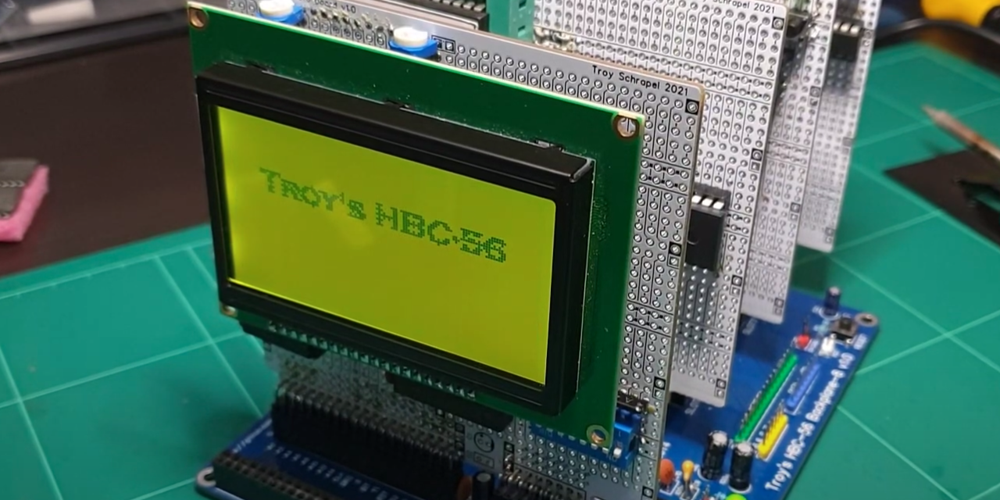

# Troy's HBC-56
My Homebrew 8-bit Computer



A homebrew 8-bit computer with a backplane. Initially supporting the 6502 CPU, TMS9918A VDP and Dual AY-3-8910 PSG's. With plans to add support for Z80 and perhaps other CPUs in the future.

Current cards:
* 6502 CPU card
* Triple-mode clock card (based on James Sharman's design)
* RAM/ROM card (32KB of each)
* LCD display card (supports regulat character LCD and 12864B graphics LCD)
* TMS9918A display card (composite output)
* Dual AY-3-8910 sound card

Current breadboard circuits:
* NES controller

All source code and schematics are available in this repository.

## Emulator
I have also included an emulator for this system. The emulator supports:

* Realtime execution of code (at 4MHz).
* Step through disassembled code with labels.
* Examine CPU and VDP registers, RAM and VRAM.
* Full support for all TMS9918A display modes. See my TMS9918 emulator here: https://github.com/visrealm/vrEmuTms9918
* Support for the dual AY-3-8910 audio.

Full details on the Emulator here: [github.com/visrealm/hbc-56/emulator](https://github.com/visrealm/hbc-56/tree/master/emulator)

## Running the demos
1. Ensure [MAKE](http://gnuwin32.sourceforge.net/packages/make.htm) is available on your system
2. Ensure [ACME assembler](https://sourceforge.net/projects/acme-crossass) is in your path
3. For each path (basic, invaders, tests\tms, tests\sfx):
 * Open a console to the path
 * Type `make` (this will build the default program and run it in the emulator:

  

 * Type `make <basefile>` (filename without extension) to build and run a specific demo eg:

```
cd code\6502\tests\tms
make tms9918gfx2text
```


#### Manually building a demo
Example: invaders
```
cd code\6502\invaders
acme -I ..\lib -I ..\kernel -o invaders.o -l invaders.o.lmap invaders.asm
```
#### Manually running a demo
Example: invaders
```
cd code\6502\invaders
..\..\..\emulator\bin\Hbc56Emu.exe --rom invaders.o
```
Example: basic
```
cd code\6502\basic
..\..\..\emulator\bin\Hbc56Emu.exe --keyboard --rom hbc56_mon.o
```


## Videos
[](https://www.youtube.com/watch?v=Ug6Ppz-NF2Q "Backplane 6502 + TMS9918: Invaders")

[](https://www.youtube.com/watch?v=x4IN8i7_U_4 "6502 8-bit homebrew with backplane. Troy's HBC-56 project preview.")

## License
This code is licensed under the [MIT](https://opensource.org/licenses/MIT "MIT") license
