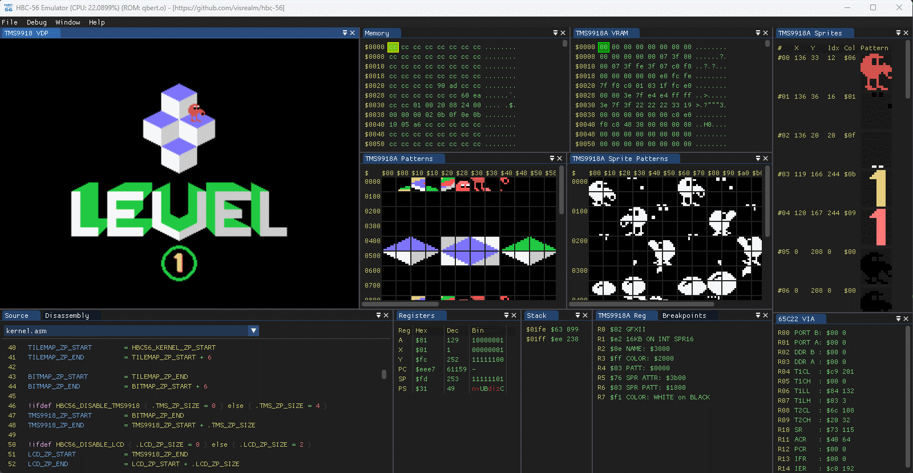

# HBC-56

<a href="https://github.com/visrealm/hbc-56/actions/workflows/pages/pages-build-deployment"></a>
<a href="https://github.com/visrealm/hbc-56/actions/workflows/cmake-multi-platform.yml"></a>
<a href="https://github.com/visrealm/hbc-56/actions/workflows/emulator-wasm.yml"></a>

A homebrew 8-bit computer on a (56 pin) backplane.

Initially supporting the 65C02 CPU, TMS9918A VDP and Dual AY-3-8910 PSG's. With plans to add support for Z80 and perhaps other CPUs in the future.

Current cards:
* 65C02 CPU card with 65C22 VIA and Interrupt controller
* RAM/ROM card (32KB of each) + optional 32KB shadow RAM
* LCD display card (supports regular character LCD and 12864B graphics LCD)
* TMS9918A display card (composite output)
* Dual AY-3-8910 sound card
* PS/2 keyboard and dual NES controller card

<p align="center"></p>

All [source code](code/6502) and [schematics](schematics) are available in this repository.

## Emulator
I have also included an emulator for this system. The emulator supports the following:

* Realtime execution of code (at ~3.7MHz).
* Step through disassembled code with labels.
* Source code debugging (using ACME assembler .rpt file).
* TMS9918 VRAM visualisation of pattern and sprite pattern tables.
* Examine CPU and VDP registers, RAM and VRAM.
* Full support for all TMS9918A display modes. See my TMS9918 emulator here: [github.com/visrealm/vrEmuTms9918](https://github.com/visrealm/vrEmuTms9918)
* Support for the dual AY-3-8910 audio, keyboard and NES controller.

The emulator is also available for Web (Beta). [HBC-56 Emulator Online](https://visrealm.github.io/hbc-56/github-pages/emulator)

<p align="center"></p>

Full details on the Emulator and source code here: [emulator](emulator)

### PICO-56

The PICO-56 project emulates the entire HBC-56 system on a single Raspberry Pi Pico.

<p align="center"></p>

PICO-56 repository: [https://github.com/visrealm/pico-56](https://github.com/visrealm/pico-56)

## Building

This project uses the CMAKE build system to build the emulator and assembler. VSCode works very well with CMAKE, but you can also build manually:

### Windows or Linux

```
$ git clone --recurse-submodules https://github.com/visrealm/hbc-56.git
$ cd hbc-56
$ cmake -B build -DCMAKE_BUILD_TYPE=Release -S .
$ cmake --build build --config Release
```

The `hbc-56/build/bin` directory will then hold everything you need to run the emulator.

### WebAssembly

To build the WebAssembly version of the emulator (from `/hbc-56`): 

##### Windows (Developer Command Prompt)
```
$ ./emconfigure build_wasm
$ cmake --build build_wasm --config Release
```

##### Linux
```
$ ./emconfigure.sh build_wasm
$ cmake --build build_wasm --config Release
```

To test the WebAssembly build, you will need to serve the files from a web server. A simple python http.server will work just fine:

```
$ cd build_wasm/bin
$ python -m http.server
Serving HTTP on :: port 8000 (http://[::]:8000/) ...
```

Then navigate to [http://localhost:8000](http://localhost:8000)

## Running the demos
There are several ways to build and run the demos. They are set up with makefiles, so it is preferred to have [MAKE](http://gnuwin32.sourceforge.net/packages/make.htm) installed and in your PATH environment variable.
#### VSCode
1. Open the [code/6502](code/6502) directory in VSCode
2. For each test/demo program (eg. basic, invaders, tests\tms, tests\sfx, etc.) navigate to the .asm file and hit **\<Ctrl\>+\<F5\>**. This will build and run the program in the emulator. **\<Ctrl\>+\<Shift\>+\<B\>** to just build the ROM image without running.
  
#### Command-line (MAKE)
  
For each path ([basic](code/6502/basic), [invaders](code/6502/invaders), [tests/tms](code/6502/tests/tms),[tests/sfx](code/6502/tests/sfx)):
1. Open a console to the path
2. Type `make` (this will build the default program and run it in the emulator:

<p align="center"></p>

 * Type `make all` to build and run all demos in the directory
 * Type `make <basefile>` (filename without extension) to build and run a specific demo eg:
 
```
cd code/6502/tests/inp
make kbtest
```

<p align="center"></p>

#### Manually building a demo (without MAKE)
Example: invaders
```
cd code\6502\invaders
..\..\..\tools\acme\acme -I ..\lib -I ..\kernel -o invaders.o -l invaders.o.lmap invaders.asm
```
#### Manually running a demo  (without MAKE)
Example: invaders
```
cd code\6502\invaders
..\..\..\emulator\bin\Hbc56Emu.exe --rom invaders.o
```

<p align="center"></p>

Example: basic
```
cd code\6502\basic
..\..\..\emulator\bin\Hbc56Emu.exe --rom basic_tms.o
```

<p align="center"></p>

## Memory map

The HBC-56 has 64KB addressable memory divided into RAM, ROM and IO as follows:

| From | To | Purpose |
|--|--|--|
| $0000 | $7eff | RAM |
| $7f00 | $7fff | I/O |
| $8000 | $ffff | ROM |

The RAM and ROM is further divided by the HBC-56 Kernel:

| From | To | Size | Purpose |
|--|--|--|--|
| $0000 | $00ff | 256 bytes | Zero page |
| $0100 | $01ff | 256 bytes | Stack |
| $0200 | $79ff | 30 kilobytes | User RAM |
| $7a00 | $7eff | 1280 bytes | Kernel RAM |
| $7f00 | $7fff | 256 bytes | I/O |
| $8000 | $dfff | 24 kilobytes | User ROM |
| $e000 | $ffff | 8 kilobytes | Kernel ROM |

IO ports for current devices (all at $7fxx)

| Port | Purpose |
|--|--|
| $02 | LCD Command |
| $03 | LCD Data |
| $08 | ROM Banking Register |
| $10 | TMS9918A Command |
| $11 | TMS9918A Data |
| $20 | UART MC68B50 Register |
| $21 | UART MC68B50 Data |
| $40 | AY-3-8910 A Register |
| $41 | AY-3-8910 A Write |
| $42 | AY-3-8910 A Read |
| $44 | AY-3-8910 B Register |
| $45 | AY-3-8910 B Write |
| $46 | AY-3-8910 B Read |
| $80 | PS/2 Keyboard Data |
| $81 | PS/2 Keyboard Status |
| $82 | NES 1 Data |
| $83 | NES 2 Data |
| $df | Interrupt Register |
| $f0 - $ff | 65c22 VIA |

### Thanks

Thanks to PCBWay for supporting this project.

[](https://pcbway.com/g/186WQ9)

## Videos
[](https://www.youtube.com/watch?v=4C_1yekWGg4 "Backplane 6502 + TMS9918: Breakout")

[](https://www.youtube.com/watch?v=Ug6Ppz-NF2Q "Backplane 6502 + TMS9918: Invaders")

[](https://www.youtube.com/watch?v=x4IN8i7_U_4 "6502 8-bit homebrew with backplane. Troy's HBC-56 project preview.")

## License
This code is licensed under the [MIT](https://opensource.org/licenses/MIT "MIT") license
