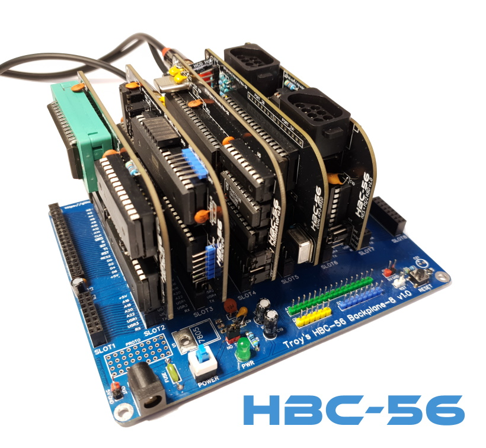
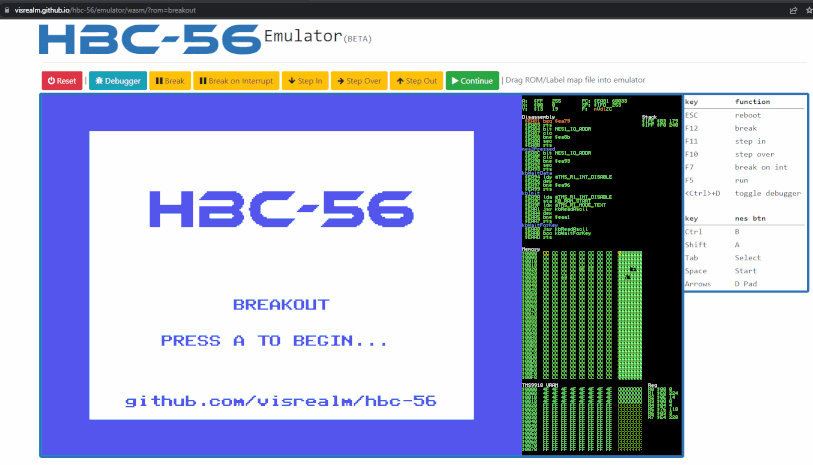
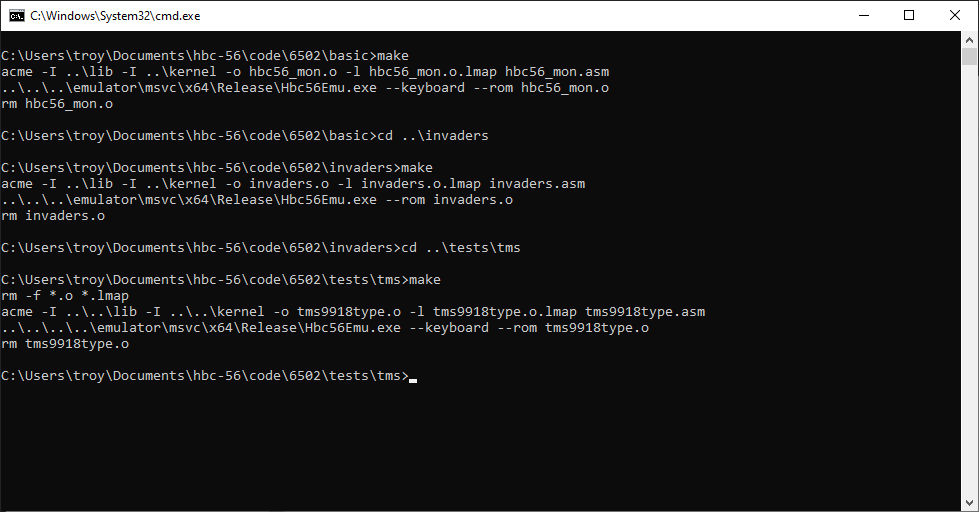
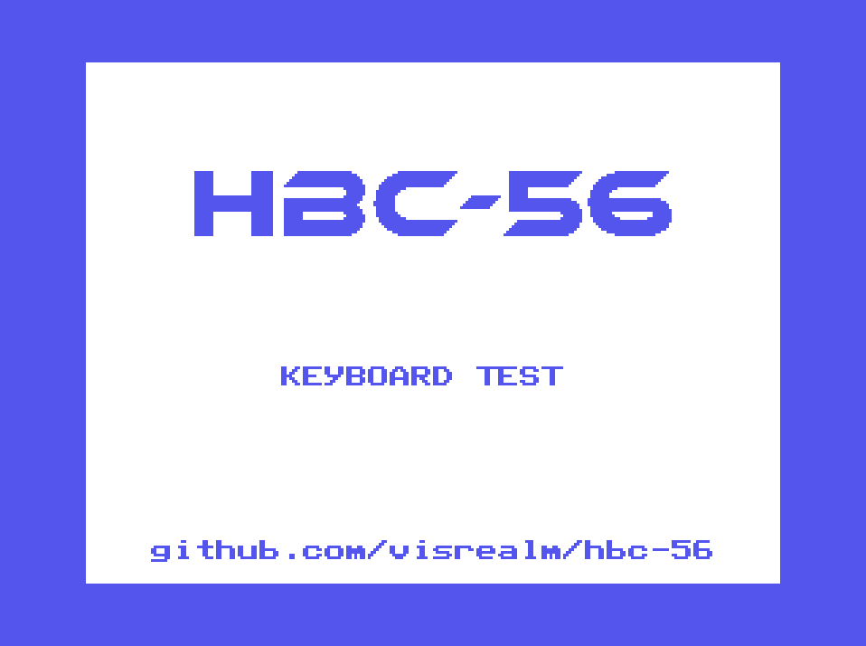
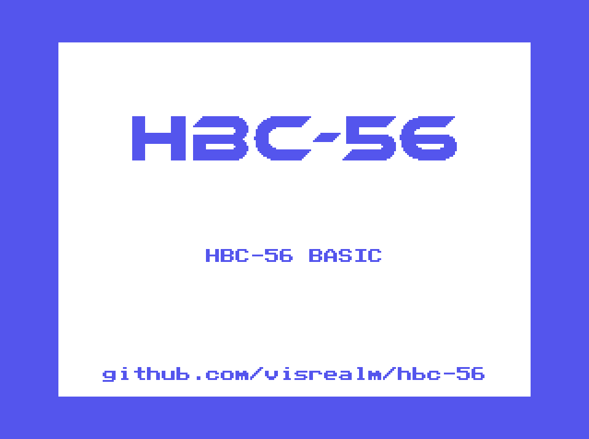

# HBC-56

A homebrew 8-bit computer on a (56 pin) backplane.

Initially supporting the 6502 CPU, TMS9918A VDP and Dual AY-3-8910 PSG's. With plans to add support for Z80 and perhaps other CPUs in the future.

Current cards:
* 6502 CPU card
* Triple-mode clock card (based on James Sharman's design)
* RAM/ROM card (32KB of each)
* LCD display card (supports regular character LCD and 12864B graphics LCD)
* TMS9918A display card (composite output)
* Dual AY-3-8910 sound card
* PS/2 keyboard and dual NES controller card



All [source code](code/6502) and [schematics](schematics) are available in this repository.

## Emulator
I have also included an emulator for this system. The emulator supports:

* Realtime execution of code (at 4MHz).
* Step through disassembled code with labels.
* Examine CPU and VDP registers, RAM and VRAM.
* Full support for all TMS9918A display modes. See my TMS9918 emulator here: [github.com/visrealm/vrEmuTms9918](https://github.com/visrealm/vrEmuTms9918)
* Support for the dual AY-3-8910 audio, keyboard and NES controller.

The emulator is also available for Web (Beta). [HBC-56 Emulator Online](https://visrealm.github.io/hbc-56/emulator/wasm)



Full details on the Emulator and source code here: [emulator](emulator)

## Running the demos
There are several ways to build ad run the demos. They are set up with makefiles, so it is preferred to have [MAKE](http://gnuwin32.sourceforge.net/packages/make.htm) installed and in your PATH environment variable.
#### VSCode
1. Open the [code/6502](code/6502) directory in VSCode
2. For each test/demo program (eg. basic, invaders, tests\tms, tests\sfx, etc.) navigate to the .asm file and hit **\<Ctrl\>+\<F5\>**. This will build and run the program in the emulator. **\<Ctrl\>+\<Shift\>+\<B\>** to just build the ROM image without running.
  
#### Command-line (MAKE)
  
For each path ([basic](code/6502/basic), [invaders](code/6502/invaders), [tests/tms](code/6502/tests/tms),[tests/sfx](code/6502/tests/sfx)):
1. Open a console to the path
2. Type `make` (this will build the default program and run it in the emulator:

  

 * Type `make all` to build and run all demos in the directory
 * Type `make <basefile>` (filename without extension) to build and run a specific demo eg:
 
```
cd code/6502/tests/inp
make kbtest
```



#### Manually building a demo (without MAKE)
Example: invaders
```
cd code\6502\invaders
..\..\..\tools\acme\acme -I ..\lib -I ..\kernel -o invaders.o -l invaders.o.lmap invaders.asm
```
#### Manually running a demo  (without MAKE)
Example: invaders
```
cd code\6502\invaders
..\..\..\emulator\bin\Hbc56Emu.exe --rom invaders.o
```


Example: basic
```
cd code\6502\basic
..\..\..\emulator\bin\Hbc56Emu.exe --rom basic_tms.o
```



## Memory map

THe HBC-56 has 64KB addressable memory divided into RAM, ROM and IO as follows:

| From | To | Purpose |
|--|--|--|
| $0000 | $7eff | RAM |
| $7f00 | $7fff | I/O |
| $8000 | $ffff | ROM |

The RAM and ROM is further divided by the HBC-56 Kernel:

| From | To | Size | Purpose |
|--|--|--|--|
| $0000 | $00ff | 256 bytes | Zero page |
| $0100 | $01ff | 256 bytes | Stack |
| $0200 | $79ff | 30 kilobytes | User RAM |
| $7a00 | $7eff | 1280 bytes | Kernel RAM |
| $7f00 | $7fff | 256 bytes | I/O |
| $8000 | $dfff | 24 kilobytes | User ROM |
| $e000 | $ffff | 8 kilobytes | Kernel ROM |

### Thanks

Thanks to PCBWay for supporting this project.

[](https://www.pcbway.com/)

## Videos
[](https://www.youtube.com/watch?v=4C_1yekWGg4 "Backplane 6502 + TMS9918: Breakout")

[](https://www.youtube.com/watch?v=Ug6Ppz-NF2Q "Backplane 6502 + TMS9918: Invaders")

[](https://www.youtube.com/watch?v=x4IN8i7_U_4 "6502 8-bit homebrew with backplane. Troy's HBC-56 project preview.")

## License
This code is licensed under the [MIT](https://opensource.org/licenses/MIT "MIT") license
